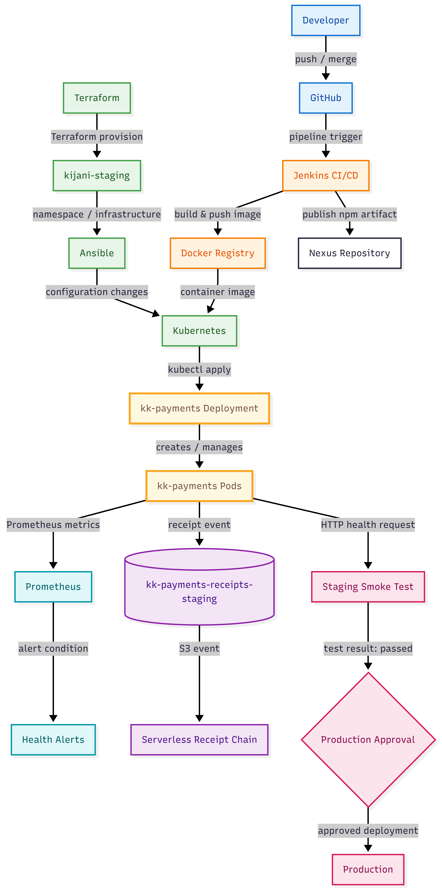

# KijaniKiosk DevOps Capstone

## 1. What is this?

KijaniKiosk is a DevOps-focused payment platform demonstrating automated application delivery, infrastructure provisioning, configuration management,containerization, Kubernetes deployment, monitoring, and a serverless receipt-processing workflow.

The project was developed incrementally across the DevOps course and brings the work together into a capstone repository. The Kubernetes environment provides staging and production-style deployment targets, while Terraform, Ansible, Jenkins, Docker, and monitoring tools provide the automation and
operational foundation.

---

## 2. Architecture

The project combines infrastructure automation, Kubernetes workloads,
CI/CD, monitoring, and the Week 10 serverless receipt chain.

### Major components

- **Application** – KijaniKiosk payment/API services.
- **Docker** – Packages the application into deployable container images.
- **Jenkins** – Provides the CI/CD pipeline for linting, building, testing,
  security auditing, publishing, container image creation, and deployment.
- **Nexus repository** – Stores the versioned npm package published by the Jenkins 
  pipeline.
- **Kubernetes / Minikube** – Runs the KijaniKiosk workloads locally,
  including staging and production-style namespaces.
- **Ingress NGINX** – Provides HTTP routing to the API and payment services.
- **Terraform** – Defines infrastructure configuration and staging
  infrastructure.
- **Ansible** – Automates host configuration and service setup.
- **Monitoring** – Provides Kubernetes monitoring components and payment
  alerting configuration.
- **Serverless receipt chain** – Week 10 introduces the receipt-processing
  workflow under `week10/serverless/receipts/`.

---

## Repository Structure

kijanikiosk-devops-foundation/
├── README.md
├── Jenkinsfile
├── Dockerfile.jenkins-agent
├── package.json
├── package-lock.json
├── index.js
│
├── deployment-pipeline/
│   ├── bluegreen/
│   └── containers/
│
├── k8s/
│   ├── kk-api-deployment.yaml
│   ├── kk-api-service.yaml
│   ├── kk-api-configmap.yaml
│   ├── kk-payments-deployment.yaml
│   ├── kk-payments-service.yaml
│   ├── kk-payments-configmap.yaml
│   ├── kk-payments-secrets.yaml.example
│   ├── kijani-ingress.yaml
│   ├── production-readiness-assessment.md
│   ├── README.md
│   └── screenshots/
│
├── monitoring/
│   └── kk-payments-alert.yaml
│
├── week4/
│   └── friday/
│       ├── terraform/
│       └── ansible/
│
├── week10/
│   ├── docs/
│   │   ├── architecture-diagram.png
│   │   ├── ai-governance-log.md
│   │   ├── Project-scope-document.odt
│   │   └── Project-scope-document.pdf
│   │
│   └── serverless/
│       └── receipts/
│           ├── handler.js
│           ├── package.json
│           ├── package-lock.json
│           └── serverless.yml
│
├── week3/
├── week5/
├── dist/
├── reflection.md
└── .gitignore

Infrastructure locations

Terraform configuration: week4/friday/terraform/

Ansible configuration: week4/friday/ansible/

Kubernetes manifests: k8s/

Jenkins pipeline: Jenkinsfile

Week 10 serverless implementation: week10/serverless/receipts/

week 10 documentation: week10/docs/

## 3. Prerequisites

The following tools are required for the local development and verification
environment.

Verified versions used during development:

Git       2.43.0
Node.js   v18.19.1
npm       9.2.0
Docker    29.7.2
Minikube  v1.38.1
kubectl   v1.36.3
Terraform v1.15.8
Ansible  core 2.21.2

Jenkins is run using Docker rather than being installed directly on the host.

.The repository also contains the custom Jenkins agent definition:

Dockerfile.jenkins-agent

The corresponding local Docker image is:

kijanikiosk-jenkins-agent:node18-kubectl

The Jenkins controller image is:

jenkins/jenkins:latest

Verify the required tools

Run:

git --version
node --version
npm --version
docker --version
docker ps
minikube version
kubectl version --client
terraform version
ansible --version

## 4. Setup

Clone the repository and enter the project:

git clone https://github.com/SharonOmbonya/kijanikiosk-devops-foundation
cd kijanikiosk-devops-foundation

Verify that the required tools are installed using the commands in the Prerequisites section.

Start the Kubernetes environment

The project uses Minikube with the Docker driver.

minikube start --driver=docker

Verify that the cluster is available:

minikube status
kubectl get nodes
kubectl get namespaces

The staging namespace used by the project is:

kijani-staging

Verify the staging workloads:

kubectl get pods -n kijani-staging
kubectl get deployments -A
Infrastructure-as-Code

Terraform configuration is located at:

week4/friday/terraform/

Ansible configuration is located at:

week4/friday/ansible/

These components form part of the project's infrastructure automation foundation.

The intended workflow is to execute infrastructure and configuration automation through the project's automation pipeline rather than treating manual Terraform and Ansible commands as the primary deployment procedure.

Week 10 serverless receipt chain

The Week 10 receipt-processing implementation is located at:

week10/serverless/receipts/

Install its dependencies:

cd week10/serverless/receipts
npm ci
cd ../../..

The directory contains:

handler.js
package.json
package-lock.json
serverless.yml

## 5. How to Run the Pipeline

The main CI/CD workflow is defined in:

Jenkinsfile

The Jenkins pipeline uses the custom agent:

kijanikiosk-jenkins-agent:node18-kubectl
Pipeline stages

The pipeline performs the following major stages:

Lint
Runs application lint checks.
Build
Installs dependencies, builds the application, and verifies that the dist/ directory contains build output.
Verify
Runs application tests and the npm security audit.
Archive
Archives successful build artifacts.
Publish
Generates an artifact version using the application version and Git commit, then publishes the package to the configured Nexus repository.
Build Docker Image
Builds the production Docker image.
Push Docker Image
Authenticates with Docker Hub and pushes the generated image.
Deploy to Staging
Updates the Kubernetes deployment with the generated Docker image and deploys it to the kijani-staging namespace.
Smoke Test Staging
Checks the running pods and waits for the staging deployment rollout to complete.
Approve Production Deployment
Requires explicit approval after the staging smoke test succeeds. The approval records the approving user and approval reason.
Deploy to Production
Creates or updates the production configuration, deploys the approved image, and waits for the production rollout.
Triggering the pipeline

The Jenkins pipeline can be triggered automatically through a GitHub webhook.

When Jenkins is running locally, a temporary ngrok tunnel can be used to make the Jenkins webhook endpoint reachable by GitHub:

ngrok http 8080

The HTTPS forwarding address displayed by ngrok is configured as the GitHub webhook Payload URL followed by:

/github-webhook/

For example:

https://your-temporary-ngrok-address.ngrok-free.app/github-webhook/

The exact ngrok address changes when a new temporary tunnel is started.

ngrok is only required for the local Jenkins webhook setup and is not a production dependency.

Do not commit ngrok authentication tokens or temporary tunnel URLs to the repository.

After the webhook triggers Jenkins, the pipeline should progress through the stages defined in Jenkinsfile.

The production deployment requires the approval gate after the staging smoke test has successfully completed.

When Jenkins pauses at the Approve Production Deployment stage, select the Input requested prompt to provide the approval and allow the pipeline to continue.

## 6. How to Verify It Works

Verify Minikube

Run:

minikube status

The expected status is:

host: Running
kubelet: Running
apiserver: Running
kubeconfig: Configured
Verify the Kubernetes node
kubectl get nodes

The Minikube node should report:

Ready
Verify namespaces
kubectl get namespaces

The project should include:

kijani-staging
Verify staging pods
kubectl get pods -n kijani-staging

The KijaniKiosk application pods should report:

Running

The expected application workloads include:

kk-api
kk-payments
Verify deployments
kubectl get deployments -A

The KijaniKiosk deployments should show their expected replicas as ready.

Verify ConfigMaps
kubectl get configmaps -n kijani-staging

Expected project configuration includes:

kk-api-config
kk-payments-config
Verify Secrets
kubectl get secrets -n kijani-staging

The payments secret should be present:

kk-payments-secrets

Only the secret name should be verified. Secret values must not be committed to the repository.

Verify Ingress
kubectl get ingress -A

The staging ingress should be available through the Minikube ingress controller.

Verify the Week 10 serverless implementation

Inspect the receipt-chain files:

find week10/serverless/receipts -maxdepth 1 -type f -print | sort

Expected files:

handler.js
package.json
package-lock.json
serverless.yml

The architecture documentation is located at:

docs/architecture-diagram.png

The AI governance documentation is located at:

docs/ai-governance-log.md

## 7. Known Limitations

This project is a development and educational DevOps environment. The following limitations identify what does not currently work as a production system, what is outside the scope of the capstone, and what would need to change for production use.

### What does not currently work as a production system

- The Kubernetes environment runs on local Minikube rather than a production Kubernetes platform.
- Jenkins runs locally in Docker and is not configured as a highly available production CI/CD service.
- The GitHub webhook uses a temporary ngrok tunnel when Jenkins is running locally. The tunnel URL can change and is intended for development/testing.
- The current monitoring configuration provides the project's monitoring and payment alerting foundation but does not provide complete production-level observability.

### Out of scope

- A managed, highly available production Kubernetes cluster.
- Enterprise-scale receipt processing for the Week 10 serverless component.
- Full production disaster recovery and business-continuity implementation.
- Complete production-scale monitoring, logging, alerting, and incident-management infrastructure.
- Enterprise secrets-management infrastructure.

### Changes required for production use

- Replace Minikube with a managed or appropriately hardened production Kubernetes environment.
- Replace the temporary ngrok webhook with a stable, secured webhook endpoint.
- Deploy Jenkins or an equivalent CI/CD platform with appropriate availability, access control, backups, and operational management.
- Replace development-oriented credential handling with a dedicated secrets-management solution supporting secure access, rotation, and auditing.
- Configure production-grade infrastructure state management, access control, networking, backups, and disaster recovery.
- Expand monitoring with production dashboards, alerting, log retention, and operational procedures.
- Further harden the production Kubernetes configuration, including security, resource management, networking, and availability controls.
- Expand the Week 10 receipt-processing workflow with additional reliability, security, error handling, observability, and operational controls before using it as an enterprise production service.
- ngrok authentication tokens and temporary tunnel URLs must never be committed to the repository.

